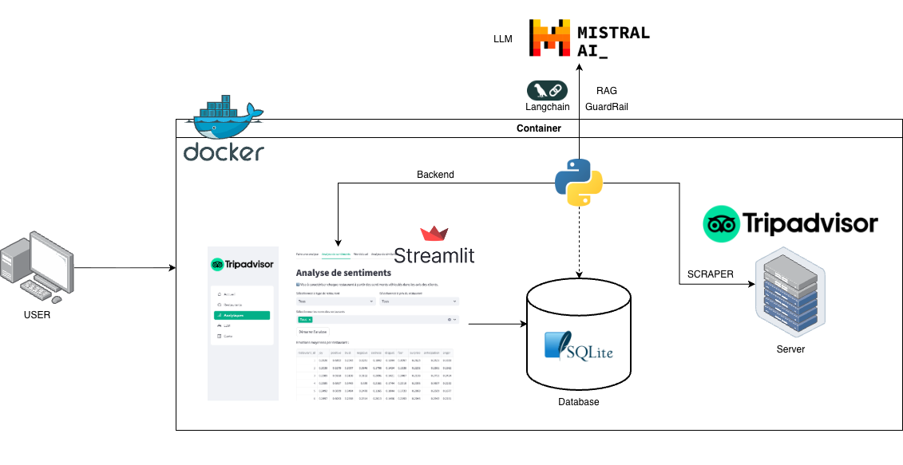

# Scraper NLP Tripadvisor

This project demonstrates the use of NLP practices by deploying analysis and models. It focuses on scraping reviews from Tripadvisor based on user feedback.

## Architecture

A scraper (BeautifulSoup) is used to gather restaurant data from all review pages. These reviews are saved into a SQLite database file, which is accessed by a Python backend. The data is then displayed on a Streamlit frontend for analysis. Additionally, an LLM from Mistral AI is used to summarize each restaurant's positive and negative points based on the comments.



## DataBase
The database follows a star schema, dividing locations, reviews, and restaurant information into separate tables. For improvement, consider adding another table for users instead of saving user information in the reviews table.

The default SQLite file is stored at `sql/tripadvisor.db`. When the application starts for the first time it creates the schema and loads the demo dataset using the SQL scripts available in the `sql/` directory.


# How to Set Up

## API Keys Setup

You can configure the API keys in two ways:

### 1. Local Environment Variables

Docker will take local variables from your environment file or machine. You can configure it using an `.env` file like the following:

```sh
SQLITE_PATH=sql/tripadvisor.db

MISTRAL_URL=http://mistralservice:8501
MISTRAL_API_KEY=${MISTRAL_API_KEY}
GOOGLE_MAPS_API_KEY=${GOOGLE_MAPS_API_KEY}
```

`SQLITE_PATH` can be an absolute path or a relative path inside the project. When the file is missing, the application will create it automatically and seed it with the demo dataset.

### 2. Direct Modification

Before starting, you need API keys from different services. Follow the steps below to obtain and configure the necessary keys.

Ensure your `docker-compose` file includes the following environment variables:
```yaml
environment:
    - SQLITE_PATH=/app/sql/tripadvisor.db
    - MISTRAL_API_KEY=${MISTRAL_API_KEY}
    - GOOGLE_MAPS_API_KEY=${GOOGLE_MAPS_API_KEY}
```


### Mistral AI

1. **Create an account:**
    If you don't have an account, register at [Mistral AI](https://auth.mistral.ai/ui/registration).

2. **Add billing information:**
    Go to [Mistral AI Billing](https://console.mistral.ai/billing/) and follow the instructions to add your billing information and credit balance.

3. **Generate an API key:**
    Visit [Mistral AI API Keys](https://console.mistral.ai/user/api-keys/) and click "Generate a new key". Copy the key and add it to your environment variables. If you are using a Unix-based OS, you can add it to your local environment variables with the name `MISTRAL_API_KEY`, and Docker will automatically use it. Alternatively for Windows users, you can directly replace `${MISTRAL_API_KEY}` in the `docker-compose` file.

### Google Maps

1. **Get an API key:**
    Follow the instructions at [Google Maps API](https://developers.google.com/maps/documentation/javascript/get-api-key) to obtain your API key.

2. **Configure the API key:**
    Add the key to your environment variables. If you are using a Unix-based OS, you can add it to your local environment variables with the name `GOOGLE_MAPS_API_KEY`, and Docker will automatically use it. Alternatively, for Windows users, you can directly replace `${GOOGLE_MAPS_API_KEY}` in the `docker-compose` file.

1. **Clone the repository:**
    ```bash
    git clone https://github.com/yourusername/NLP-TripAdvisor.git
    cd NLP-TripAdvisor
    ```
    Ensure you have Docker installed and run:

2. **Docker setup:**
    ```bash
    docker-compose up --build -d
    ```

4. **Access the web application:**
    The application will be available at `http://localhost:8502`

5. **Close the Docker Image**
   When you are done with the webb app, you can do this command on your terminal.
   ```bash
    docker-compose down
    ```

### Local set up
Install your favorite

## Collaborators

- **[@maxenceLIOGIER](https://github.com/maxenceLIOGIER)**
- **[@Cyr-CK](https://github.com/Cyr-CK)**
- **[@jdalfons](https://github.com/jdalfons)**
